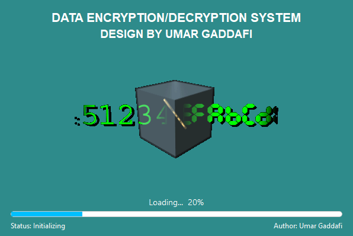
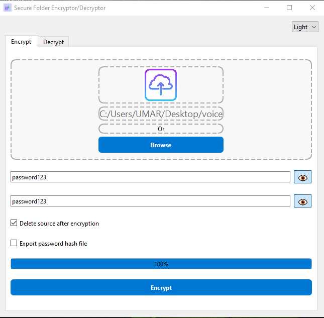

# 🔐 Folder Encryptor/Decryptor

[](https://github.com/umgaddafi/Advanced-folder-Enc-Dec/releases)
[](https://github.com/umgaddafi/Advanced-folder-Enc-Dec/issues)

A lightweight, secure, and user-friendly application for encrypting and decrypting folders on Windows. Ideal for protecting sensitive files with strong encryption.

## 📥 Download

👉 [**Download Folder Encryptor/Decryptor v1.0.0 (.exe)**](https://github.com/umgaddafi/Advanced-folder-Enc-Dec/releases/download/v1.0.1/setup.exe)

## 🚀 Getting Started

To start using the application:

1. **Download** the installer from the link above.
2. **Run** the `setup.exe` file.
3. **Follow** the installation instructions.
4. **Launch** the app from the Start Menu or Desktop.
5. **Select** a folder and choose whether to encrypt or decrypt.

## ✨ Features

* 🔐 **Secure Folder Encryption** – Uses robust encryption algorithms (e.g., AES-256) to keep your files safe.
* 🔓 **One-Click Decryption** – Easily restore access to encrypted folders.
* 🧼 **Simple UI** – Minimal, clean interface that requires no technical background.
* 🔒 **Offline Security** – No internet access required. Everything runs locally.
* ⚡ **Fast & Lightweight** – Optimized for performance and small system footprint.

## 🖼️ Screenshots

| Splash Screen                          | Encryption View                           |
| ------------------------------------ | ----------------------------------------- |
|  |  |


## ❓ Frequently Asked Questions

### 🔸 What encryption method is used?

> The application uses **AES-256** encryption, a widely trusted industry-standard encryption algorithm.

### 🔸 Can I recover a lost password?

> No. Passwords are not stored or recoverable. Always keep your password safe.

### 🔸 Does the app work offline?

> Yes. All encryption and decryption are performed locally on your machine.

### 🔸 Is it open source?

> Yes! You can view, modify, and contribute to the project on [GitHub](https://github.com/umgaddafi/Advanced-folder-Enc-Dec).

---

## 🛠️ Build From Source

To build the project manually:

```bash
git clone https://github.com/umgaddafi/Advanced-folder-Enc-Dec.git
cd Advanced-folder-Enc-Dec
# Open the project in your IDE or build it using your toolchain
```

## 📫 Support

Found a bug or have a feature request?
👉 Submit it via [GitHub Issues](https://github.com/umgaddafi/Advanced-folder-Enc-Dec/issues)


